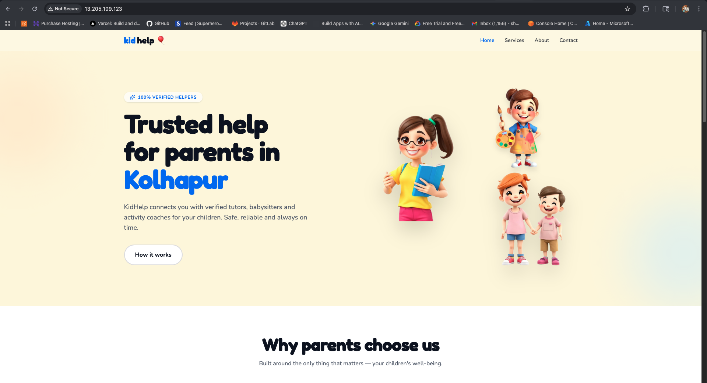

# AWS EC2 & Nginx Deployment

This branch documents the manual deployment of a React application on a virtual private server.

### 🛠 Deployment Steps
1. **Provisioning:** Launched an **Ubuntu 24.04 LTS** instance on AWS EC2.
2. **Security Groups:** Configured Inbound rules for **SSH (22)** and **HTTP (80)**.
3. **Environment Setup:**
   - Installed **Node.js v22** using NVM to support Vite 7.
   - Installed **Nginx**: `sudo apt install nginx -y`.
4. **Configuration:** - Modified `/etc/nginx/sites-available/default` to handle SPA routing using the `try_files` directive.
5. **Process:** Built the project locally (`npm run build`) and transferred files to `/var/www/html` via SCP/Git.

### 📦 Technical Stack
- **OS:** Ubuntu 24.04
- **Web Server:** Nginx v1.24
- **Runtime:** Node.js v22.x

### 🖼️ Setup & Configuration

*Figure 1: AWS EC2 Dashboard showing the running instance and Public IP.*
