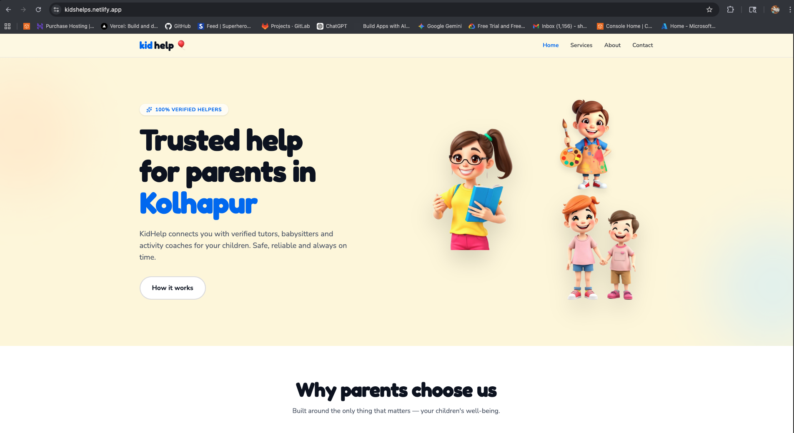

# Vercel & Netlify Deployment (PaaS)

This branch showcases the use of developer-focused platforms for automated CI/CD workflows.

### 🛠 Deployment Steps
1. **Git Integration:** Connected the GitHub repository to **Vercel** and **Netlify** dashboards.
2. **Build Settings:** Configured build commands (`npm run build`) and output directory (`dist`).
3. **Auto-Deployment:** Set up **Webhook-based CI/CD**, where every `git push` triggers a new production build.
4. **Redirects:**
   - **Netlify:** Created a `_redirects` file with `/* /index.html 200`.
   - **Vercel:** Configured `vercel.json` for rewrites to handle client-side routing.

### 📦 Technical Stack
- **Platforms:** Vercel, Netlify
- **Workflow:** Automated CI/CD (GitHub Webhooks)
- **SSL:** Auto-generated Let's Encrypt certificates

### 🖼️ Setup & Configuration

*Figure 1: Vercel Dashboard showing the "Deployment Successful" green checkmark.*

*Figure 2: Netlify Dashboard showing the "Deployment Successful" checkmark.*
