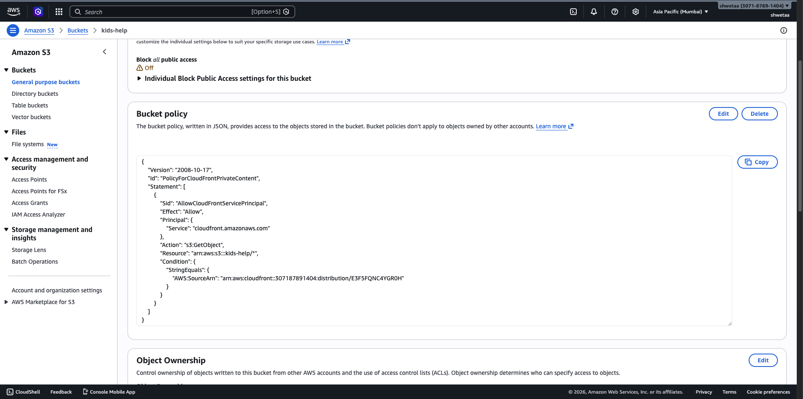
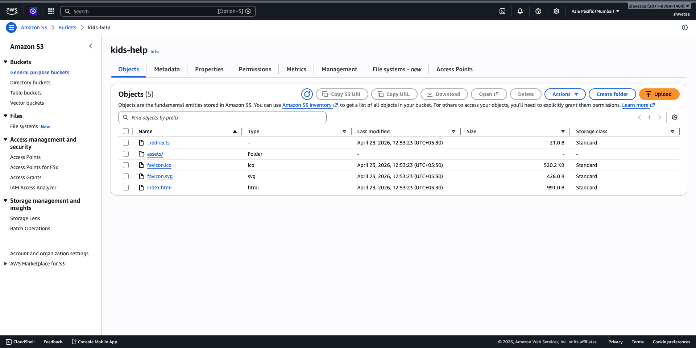
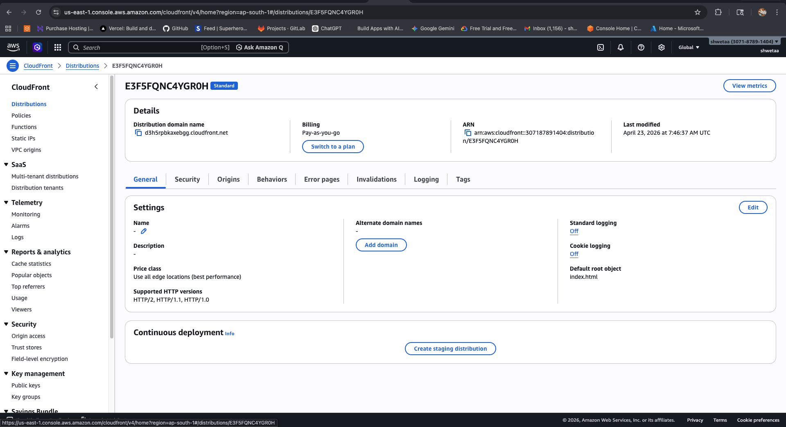

# AWS S3 + CloudFront (OAC & SSL)

This branch documents a secure, serverless architecture for global content delivery.

### 🛠 Deployment Steps
1. **Storage:** Created a private **S3 Bucket** and uploaded the production build.
2. **CDN Setup:** Initialized a **CloudFront Distribution** with **Origin Access Control (OAC)**.
3. **Security:** Updated the S3 **Bucket Policy** to restrict access solely to the CloudFront Service Principal.
4. **SSL/HTTPS:** Enabled **Managed SSL/TLS** certificates for encrypted data transit.
5. **Routing Fix:** Configured **Custom Error Responses** (403 -> 200 /index.html) to support React Router.

### 📦 Technical Stack
- **Storage:** Amazon S3
- **CDN:** Amazon CloudFront
- **Security:** OAC + SSL/TLS

### 🖼️ Setup & Configuration

*Figure 1: Creating and configuring the Amazon S3 bucket for static website hosting.*

*Figure 2: Uploading website files and static assets to the S3 bucket.*

*Figure 3: Overview of the AWS Cloud architecture and configuration.*

*Figure 4: Setting up the Amazon CloudFront distribution with Origin Access Control (OAC) and SSL.*
